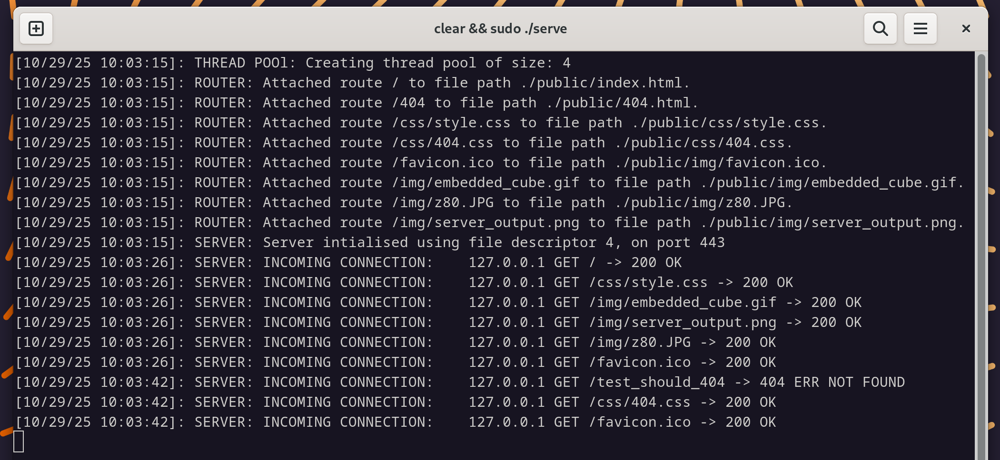

# Multithreaded HTTPS Web Server

[](https://github.com/jackwthake/Web-Server/actions/workflows/codeql.yml)


*Server logs showing thread pool initialization, route loading, and real-time request handling*

A high-performance, lightweight HTTPS web server implemented in modern C++17. Features secure TLS/SSL encryption, concurrent request handling via thread pooling, rate limiting, automatic log rotation, and efficient resource management using smart pointers and RAII principles.

## Overview

This project demonstrates advanced C++ systems programming concepts including network programming, multi-threading, SSL/TLS cryptography, lock-free concurrency, and modern memory management techniques. Built from the ground up using POSIX sockets and OpenSSL, it showcases low-level understanding of network protocols, concurrent programming patterns, and production-ready operational features including rate limiting, automatic log rotation, and real-time monitoring.

## Key Features

### Security
- **TLS/SSL Encryption**: Full HTTPS support using OpenSSL 3.0+
- **Rate Limiting**: IP-based request throttling with configurable limits (100 req/60s default)
- **Whitelist Routing**: Pre-loaded route table prevents path traversal attacks
- **Secure Certificate Handling**: Proper key management with automatic resource cleanup
- **Exception-Based Error Handling**: Proper cleanup and resource management during failures
- **Input Validation**: Robust handling of malformed and empty requests

### Performance
- **Thread Pool Architecture**: Dynamic worker thread pool scaling with hardware concurrency
- **Lock-Free Rate Limiting**: Atomic operations with compare-and-swap for thread-safe IP tracking
- **Pre-Loaded Content**: Zero disk I/O per request - all files loaded into memory at startup
- **Non-blocking I/O**: Efficient request handling using condition variables and mutexes
- **Resource Management**: Smart pointers with custom deleters for zero-leak guarantee

### Monitoring & Operations
- **Real-Time Metrics**: `/status` endpoint with JSON statistics (uptime, requests, rate limits)
- **Automatic Log Rotation**: Log files automatically culled at 50MB to prevent disk exhaustion
- **IP Tracking & Analytics**: CSV export of IP access patterns with request counts and timestamps
- **Comprehensive Logging**: Thread-safe logging to console and file with automatic timestamps
- **Statistics Tracking**: Atomic counters for total, valid, successful, and rate-limited requests

### Configuration
- **File-Based Configuration**: `secure-serve.conf` for all server parameters
- **Configurable Thread Pool**: Adjust worker thread count or auto-scale to CPU cores
- **Flexible Rate Limits**: Customize time windows and request thresholds per IP
- **Routing Configuration**: Separate `endpoints.conf` for URL-to-file mappings

## Architecture

### Request Processing Flow

```
1. Startup
   ├─> Configuration loaded from secure-serve.conf
   ├─> Routes loaded from endpoints.conf into memory
   ├─> SSL context initialized with certificates
   └─> Thread pool created (configurable or auto-scaled to CPU cores)

2. Client Connection
   ├─> TCP socket accepted on port 443 (HTTPS)
   ├─> Rate limiting check (lock-free atomic operations)
   │   ├─> If rate limited: drop connection and log
   │   └─> If allowed: continue processing
   ├─> SSL/TLS handshake performed
   └─> Connection validated

3. Request Handling
   ├─> Job queued to thread pool
   ├─> Available worker thread picks up job
   ├─> Request parsed and validated
   └─> Method and path extracted

4. Response Generation
   ├─> Route matched against pre-loaded routing table
   ├─> File content retrieved from memory (zero disk I/O)
   ├─> MIME type set from routing configuration
   ├─> HTTP response constructed (200, 404, or 405)
   └─> Statistics updated (atomic counters)

5. Cleanup
   ├─> Response sent over SSL connection
   ├─> SSL session terminated (bidirectional SSL_shutdown)
   ├─> Resources automatically freed (RAII)
   └─> IP log table updated with request timestamp

6. Periodic Maintenance (every 100 requests)
   ├─> Log files culled if exceeding 50MB
   ├─> IP log table culled (entries older than 1 hour)
   └─> IP access data exported to CSV
```

### Core Components

- **`https_server`**: Main server class managing SSL context, socket lifecycle, routing, and statistics
- **`thread_pool`**: Worker thread manager with condition variable synchronization
- **`job_t`**: Request job structure passed to worker threads
- **Routing System**: Hash-map based URL-to-file routing with pre-loaded content for security
- **Rate Limiter**: Lock-free IP-based request throttling using atomic compare-and-swap operations
- **IP Log Table**: Thread-safe tracking of per-IP request counts and timestamps with automatic CSV export
- **Statistics Counters**: Atomic counters for real-time metrics (total, valid, successful, rate-limited requests)
- **Configuration Manager**: `std::variant`-based config system supporting both string and integer values

## Deployment

### Automated EC2 Deployment Pipeline

This project includes a fully automated deployment pipeline for AWS EC2 instances with zero-downtime updates and automatic crash recovery.

#### Deployment Workflow

```
1. Initial Launch (EC2 User Data runs install.sh)
   ├─> Install system dependencies and certbot
   ├─> Clone repository to ~/secure-serve
   ├─> Obtain Let's Encrypt SSL certificates (jackthake.com)
   ├─> Configure systemd services (server, reboot, cert renewal)
   └─> Build and start server

2. Production Updates (git push + EC2 reboot)
   ├─> Developer pushes code to GitHub
   ├─> Reboot EC2 instance
   ├─> secure-serve-reboot.service triggers
   ├─> System updates (yum update)
   ├─> Git pulls latest code
   ├─> CMake rebuilds project
   └─> Server restarts with new version

3. Crash Recovery (automatic)
   ├─> Server process crashes/exits
   ├─> secure-serve.service detects failure
   ├─> Waits 10 seconds
   └─> Automatically restarts server

4. SSL Certificate Renewal (automatic)
   ├─> certbot-renew.timer triggers (twice daily)
   ├─> Checks if certificates need renewal (< 30 days)
   ├─> If needed: stops server, renews certs, restarts server
   └─> Logs renewal attempt
```

#### Service Management

```bash
# Check server status
sudo systemctl status secure-serve.service

# View real-time server logs
sudo journalctl -u secure-serve.service -f

# View deployment logs
sudo journalctl -u secure-serve-reboot.service

# Manual server restart
sudo systemctl restart secure-serve.service

# Manual deployment (without reboot)
sudo systemctl start secure-serve-reboot.service
```

#### Benefits

- **Zero-touch deployments**: Push code and reboot - no SSH required
- **Automatic recovery**: Server crashes are handled without manual intervention
- **Always up-to-date**: System updates applied on every reboot
- **Production-ready**: Proper service management with logging and monitoring

### Manual Local Build

#### Prerequisites

```bash
# Ubuntu/Debian
sudo apt-get install build-essential cmake libssl-dev

# Fedora/RHEL
sudo dnf install gcc-c++ cmake openssl-devel
```

#### Build

```bash
git clone https://github.com/jackwthake/Web-Server
cd Web-Server

# Modern CMake approach
cmake -B build
cmake --build build
cd build
sudo ./serve
```

The server will start on `https://localhost:443` (requires root/sudo for port 443)


### Testing HTTPS Connection

```bash
# Using curl (accept self-signed certificate)
curl -k https://localhost

# Using browser
# Navigate to https://localhost
# Accept security warning for self-signed certificate
```

## Configuration

### Server Configuration

Server settings are defined in `secure-serve.conf` with `key=value` format:

```bash
# Server configuration
server_port=443
backlog=1000
thread_pool_size=8                          # 0 = auto-scale to CPU cores
router_config_path=./public/endpoints.conf
domain=jackthake.com

# Logging configuration
log_max_size=52428800                       # 50MB in bytes

# SSL configuration
ssl_cert_path=./secret/server.crt
ssl_key_path=./secret/server.key

# Rate limiting configuration
rate_limit_time_window=60                   # Time window in seconds
rate_limit_max_requests=100                 # Max requests per IP per window
ip_log_cull_threshold=3600                  # Remove IPs inactive for 1 hour
```

All configuration values have sensible defaults, so the config file is optional.

### Routing Configuration

Routes are defined in `public/endpoints.conf` with the format:
```
<url_path> <file_path> <mime_type>
```

**Security Note**: All files are loaded into memory at startup, creating a whitelist of allowed routes. This prevents path traversal attacks since requests are only matched against pre-loaded routes, never accessing the filesystem dynamically.

Example:
```
# comments are supported
/ ./public/index.html text/html
/404 ./public/404.html text/html

/css/style.css ./public/css/style.css text/css
/img/logo.png ./public/img/logo.png image/png
```

### Status Endpoint

The server provides a `/status` endpoint that returns JSON metrics:

```bash
curl https://localhost/status
```

Response:
```json
{
  "uptime": "2d 5h 30m 15s",
  "platform": "Linux",
  "os_version": "Amazon Linux 2",
  "server_version": "1.0.0",
  "thread_count": 8,
  "total_requests": 15847,
  "valid_requests": 15720,
  "successful_requests": 15650,
  "rate_limited_requests": 127
}
```

### SSL Certificates

#### Production (Let's Encrypt)

The deployment pipeline automatically obtains and renews production SSL certificates from Let's Encrypt:

- **Initial Setup**: `install.sh` uses certbot to obtain certificates for `jackthake.com` and `www.jackthake.com`
- **Auto-Renewal**: Systemd timer runs twice daily to check and renew certificates before expiration
- **Zero-Downtime**: Renewal process temporarily stops the server, renews certificates, and restarts automatically
- **Certificate Location**: Certificates are symlinked from `/etc/letsencrypt/live/jackthake.com/` to `./secret/`

Check certificate status:
```bash
# View certificate expiration
sudo certbot certificates

# Check renewal timer status
sudo systemctl status certbot-renew.timer

# View renewal logs
sudo journalctl -u certbot-renew.service

# Manually test renewal (dry-run)
sudo certbot renew --dry-run
```

#### Development (Self-Signed)

For local development, use self-signed certificates in `./secret/`:
```bash
openssl req -x509 -newkey rsa:4096 -keyout secret/server.key -out secret/server.crt -days 365 -nodes -subj "/CN=localhost"
```

- `server.crt` - SSL certificate
- `server.key` - Private key

## Technical Highlights

### Modern C++ Practices

- **Smart Pointers**: Custom deleters for OpenSSL resources (`SSL_CTX`, `SSL`)
- **Optional Types**: `std::optional` for safe null handling instead of raw pointers
- **Move Semantics**: Efficient resource transfer in thread pool
- **Type Safety**: `nullptr` instead of `NULL`, strong typing throughout

### Concurrency

- **Thread-Safe**: Mutex-protected job queue with condition variables
- **Lock-Free Rate Limiting**: Atomic operations with compare-and-swap for race-free IP tracking
- **Atomic Statistics**: Thread-safe counters for request tracking without locks
- **Deadlock-Free**: Scoped locking patterns with RAII
- **Scalable**: Thread pool size dynamically matches CPU core count or configured value

### Memory Management

- **Zero-Copy**: Direct SSL buffer handling
- **No Memory Leaks**: Verified with Valgrind and static analysis
- **Exception-Safe**: RAII ensures cleanup even during error conditions

## Development & Testing

### Logging

Server logs are written to `logs/server.log` with automatic timestamps:
```
[10/29/25 11:05:22]: THREAD POOL: Creating thread pool of size: 8
[10/29/25 11:05:22]: ROUTER: Attached route / to file path ./public/index.html.
[10/29/25 11:05:22]: ROUTER: Attached route /404 to file path ./public/404.html.
[10/29/25 11:05:22]: ROUTER: Attached route /css/style.css to file path ./public/css/style.css.
[10/29/25 11:05:22]: SERVER: Server intialised using file descriptor 4, on port 443
[10/29/25 11:05:45]: SERVER: INCOMING CONNECTION:   192.0.2.50 GET / -> 200 OK
[10/29/25 11:05:46]: SERVER: INCOMING CONNECTION:   192.0.2.50 GET /css/style.css -> 200 OK
[10/29/25 11:06:22]: SERVER: INCOMING CONNECTION:  203.0.113.45 - Rate limit exceeded, dropping connection.
```

**Features:**
- **Thread-Safe**: Mutex-protected logging prevents garbled output
- **Automatic Rotation**: Logs culled to 50MB every 100 requests to prevent disk exhaustion
- **CSV Export**: IP access data exported to `logs/ip_log.csv` with timestamps and request counts
- **Multiple Log Files**: Separate logs for server operations, deployments, and certificate renewals

### IP Tracking CSV

The server exports IP access data to `logs/ip_log.csv`:

| IP Address | Request Count | Last Request Timestamp | Last Request Time |
|------------|---------------|------------------------|-------------------|
| 192.0.2.50 | 45 | 1730398400 | 2024-10-31 09:13:20 |
| 198.51.100.42 | 101 | 1730398460 | 2024-10-31 09:14:20 |

This data is useful for:
- Analyzing traffic patterns
- Identifying aggressive clients
- Understanding geographic distribution
- Detecting potential attacks

## License

This project is provided as-is for educational and portfolio purposes.
